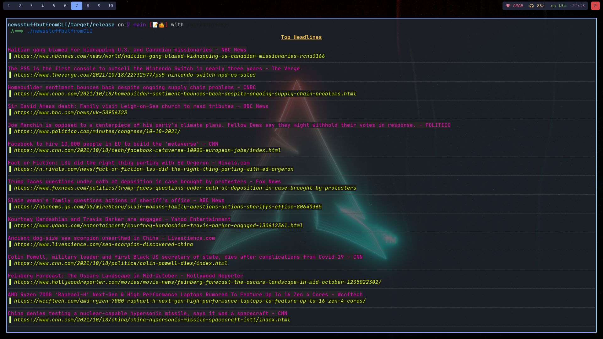

<h1 align="center">newsstuffbutfromCLI<h1/>

### CLI news ,needs rustc 1.54 or above 

## To build the executable: 🛠️
```bash
cargo build --release && cd target 
```
## To run: 🏃
```bash
./newsstuffbutfromCLI
```

> set API_KEY in shell 
## HoW iT LookS: 👀  


